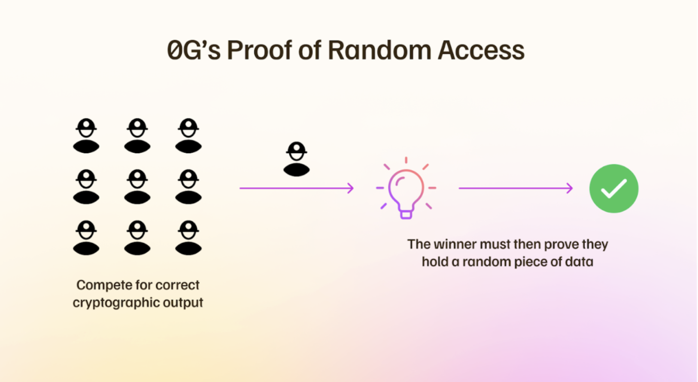

# 0G Storage: Decentralized AI-Optimized Storage

## **Overview**

0G Storage is a decentralized storage system designed for massive data workloads, particularly AI and Web3 applications. Unlike traditional centralized storage, 0G distributes data across a network, improving security, availability, and scalability. 

## System Architecture

0G Storage consists of two main components:

1. **Data Publishing Lane**: Ensures fast Merkle tree data root commitment and verification through 0G Chain.
2. **Data Storage Lane**: Manages large data transfers and storage using an erasure-coding mechanism for redundancy and sharding for parallel processing.

The system is powered by **Proof of Random Access (PoRA)**, a consensus mechanism that incentivizes miners to store and verify data efficiently.

## **Key Features**  
- **Layered Storage Architecture:**  
  - **Log Layer:** Stores unstructured, append-only data for archival use.  
  - **Key-Value Layer:** Enables fast, structured data retrieval for dynamic applications.  
- **Decentralized Incentives:** Storage nodes earn rewards in 0G tokens by participating in the network.  
- **Scalability:** Optimized for AI workloads, with seamless integration into decentralized AI ecosystems.

  

For in-depth technical details about 0G Storage, please read our [Intro to 0G Storage](https://docs.0g.ai/0g-storage).

## Documentation

- If you want to run a node, please refer to the [Running a Node](https://docs.0g.ai/run-a-node/storage-node) guide.
- If you want to conduct local testing, please refer to [Onebox Testing](https://github.com/0glabs/0g-storage-node/blob/main/docs/onebox-test.md) guide.
- If you want to build a project using 0G storage, please refer to the [0G Storage SDK](https://docs.0g.ai/build-with-0g/storage-sdk) guide.

## Support and Additional Resources
We want to do everything we can to help you be successful while working on your contribution and projects. Here, you'll find various resources and communities that may help you complete a project or contribute to 0G. 

### Communities
- [0G Telegram](https://t.me/web3_0glabs)
- [0G Discord](https://discord.com/invite/0glabs)
- [OG X](https://x.com/0G_labs)
