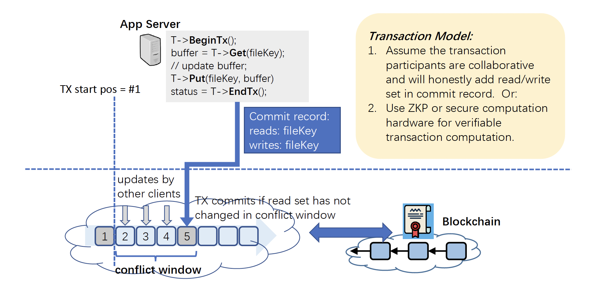

# Introduction

_ZeroGravity_ system consists of a data availability layer (0G DA) on top of a decentralized storage system (0G Storage). There is a separate consensus network that is part of both the 0G DA and the 0G Storage. For 0G Storage, the consensus is responsible for determining the ordering of the uploaded data blocks, realizing the storage mining verification and the corresponding incentive mechanism through smart contracts.

Figure 1 illustrates the architecture of the 0G system. When a data block enters the 0G DA, it is first erasure coded and organized into multiple consecutive chunks through erasure coding. The merkle root as a commitment of the encoded data block is then submitted to the consensus layer to keep the order of the data entering the system. The chunks are then dispersed to different storage nodes in 0G Storage where the data may be further replicated to other nodes depending on the storage fee that the user pays. The storage nodes periodically participate the mining process by interacting with the consensus network to accrue rewards from the system.

<figure><figcaption>
Figure 1. The Architecture of ZeroG System
</figcaption></figure>

